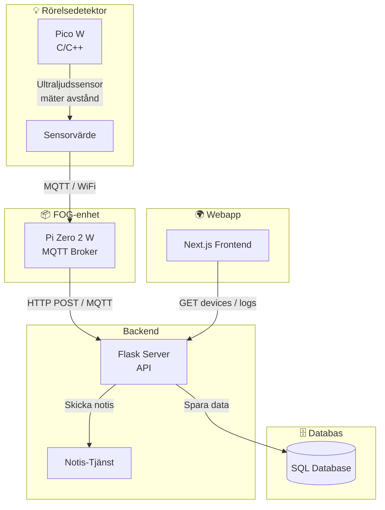
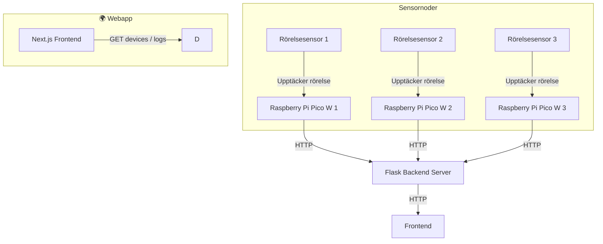

# Plan


# Leverans



## Tech stack

- ✅ Frontend – React (med Next.js)
- ✅ Backend – Python (Flask) för API & datahantering
- ✅ Mikrokontroller – C/C++ (Embedded C) på Raspberry Pi Pico W
- ✅ Fog-enhet – C (Raspberry Pi Zero 2 W) med MQTT
- ✅ Databas – SQLite

# IoT Alarm Dashboard

This project is an IoT-based alarm system with a Next.js frontend and a Flask backend. The system allows users to monitor and control alarm devices in multiple households via a web interface.

## 🚀 Features

- View connected alarm devices
- Toggle alarm on/off for each device
- View activity logs

# IoT Motion Detection System

## First-Time Setup

Follow these steps to set up the project for the first time.

### 1️⃣ **Clone the Repository**

```bash
git clone [https://github.com/hemlarm.git](https://github.com/PhilipSamuelsson/hemlarm.git)
cd hemlarm
```

### 2️⃣ **Set Up Frontend (Next.js)**

```bash
cd ../frontend
npm install  # Install dependencies
```

### 3️⃣ **Set Up Frontend Environment Variables**

Create a `.env.local` file inside the `frontend/` folder:

```bash
cat > .env.local << EOF
NEXT_PUBLIC_API_URL = https://hemlarm.onrender.com/api
EOF
```

### 4️⃣ **Start the Frontend**

```bash
npm run dev
```

---

## 🔄 Continuing Development

### **Starting the Frontend**

```bash
cd frontend
npm run dev  # Start Next.js frontend
```

### **Stopping the Application**

- **Frontend:** Press `CTRL+C` in the terminal.

---

## 🧪 Testing the API

The frontend should now be running at: **http://localhost:3000**

Open a browser or Postman and visit:
https://hemlarm.onrender.com/api/devices
and
https://hemlarm.onrender.com/api/logs

### ✅ You're now ready to develop and test your IoT Motion Detection System!
