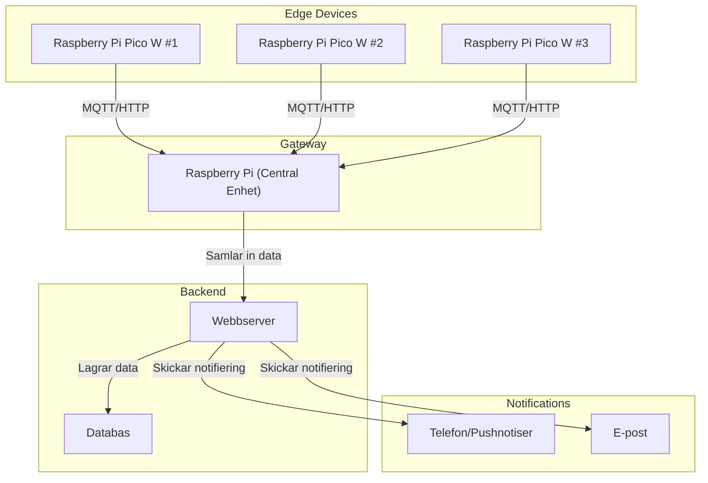

# Diagram

## Tech stack

✅ Frontend – React (med Next.js) eller Vue (med Nuxt.js)
✅ Backend – Python (FastAPI eller Flask) för API & datahantering
✅ Mikrokontroller – Python (MicroPython) på Raspberry Pi Pico W
✅ Gateway & Server – Python (Raspberry Pi 3) med MQTT eller WebSockets
✅ Databas – SQLite, PostgreSQL eller Firebase (beroende på behov)
