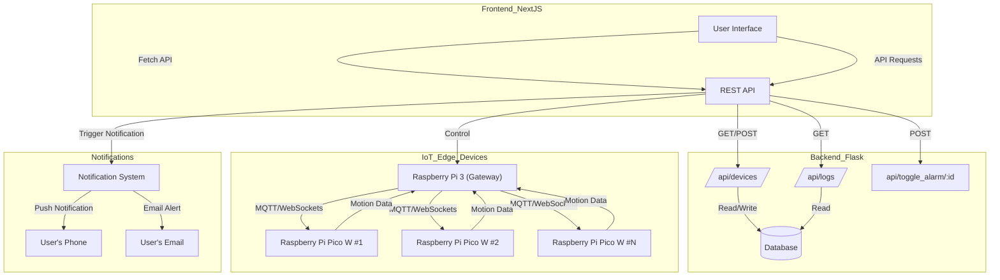

# Diagram


## Tech stack

- ✅ Frontend – React (med Next.js) eller Vue (med Nuxt.js)
- ✅ Backend – Python (FastAPI eller Flask) för API & datahantering
- ✅ Mikrokontroller – Python (MicroPython) på Raspberry Pi Pico W
- ✅ Gateway & Server – Python (Raspberry Pi 3) med MQTT eller WebSockets
- ✅ Databas – SQLite, PostgreSQL eller Firebase (beroende på behov)


# IoT Alarm Dashboard

This project is an IoT-based alarm system with a Next.js frontend and a Flask backend. The system allows users to monitor and control alarm devices in multiple households via a web interface.

## 🚀 Features
- View connected alarm devices
- Toggle alarm on/off for each device
- View activity logs

# IoT Motion Detection System

## 🚀 First-Time Setup

Follow these steps to set up the project for the first time.

### 1️⃣ **Clone the Repository**
```bash
git clone [https://github.com/hemlarm.git](https://github.com/PhilipSamuelsson/hemlarm.git)
cd hemlarm
```

### 2️⃣ **Set Up Backend (Flask)**
```bash
cd backend
python -m venv venv  # Create virtual environment
source venv/bin/activate  # Activate (Mac/Linux)
venv\Scripts\activate  # Activate (Windows)
pip install -r requirements.txt  # Install dependencies
```

### 4️⃣ **Start the Backend**
```bash
python run.py
```

### 5️⃣ **Set Up Frontend (Next.js)**
```bash
cd ../frontend
npm install  # Install dependencies
```

### 6️⃣ **Set Up Frontend Environment Variables**
Create a `.env.local` file inside the `frontend/` folder:
```bash
cat > .env.local << EOF
NEXT_PUBLIC_API_URL=http://localhost:5000/api
EOF
```

### 7️⃣ **Start the Frontend**
```bash
npm run dev
```

---

## 🔄 Continuing Development

### **Starting the Backend**
```bash
cd backend
source venv/bin/activate  # Activate virtual environment (Linux)
venv\Scripts\activate  # Activate (Windows)
python run.py  # Start Flask API
```

### **Starting the Frontend**
```bash
cd frontend
npm run dev  # Start Next.js frontend
```

### **Checking Logs**
- **Backend logs**: Open terminal in `backend/` and watch for Flask API logs.
- **Frontend logs**: Open browser DevTools (`F12`) → Console.

### **Stopping the Application**
- **Backend:** Press `CTRL+C` in the terminal.
- **Frontend:** Press `CTRL+C` in the terminal.

---


## 🧪 Testing the API 
The frontend should now be running at: **http://localhost:3000** 

Open a browser or Postman and visit: 
http://127.0.0.1:5000/api/devices 
and
http://127.0.0.1:5000/api/logs

Or use curl: sh curl http://127.0.0.1:5000/api/devices

### ✅ You're now ready to develop and test your IoT Motion Detection System!
