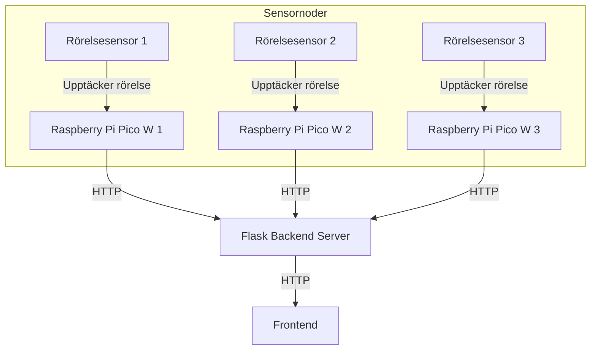

```mermaid
graph TD;
    subgraph Sensornoder
        PIR1["Rörelsesensor 1"] -->|"Upptäcker rörelse"| Pico1["Raspberry Pi Pico W 1"];
        PIR2["Rörelsesensor 2"] -->|"Upptäcker rörelse"| Pico2["Raspberry Pi Pico W 2"];
        PIR3["Rörelsesensor 3"] -->|"Upptäcker rörelse"| Pico3["Raspberry Pi Pico W 3"];
    end
    
    Pico1 -->|"HTTP"| Flask["Flask Backend Server"];
    Pico2 -->|"HTTP"| Flask;
    Pico3 -->|"HTTP"| Flask;
    
    Flask -->|"HTTP"| Frontend["Frontend"];
```
