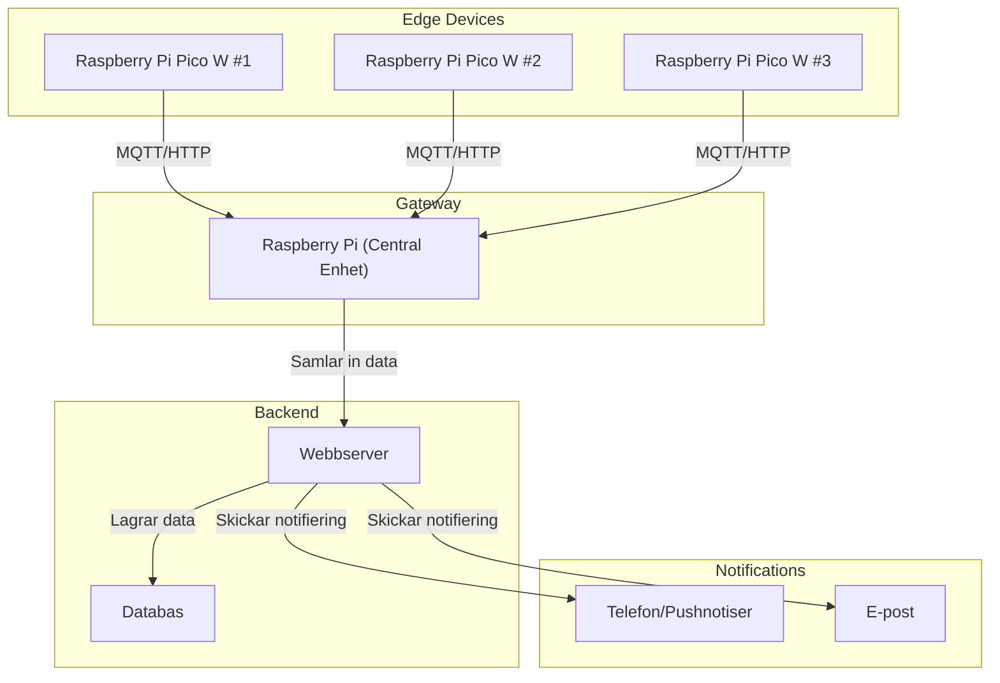

# Diagram


## Tech stack

- ✅ Frontend – React (med Next.js) eller Vue (med Nuxt.js)
- ✅ Backend – Python (FastAPI eller Flask) för API & datahantering
- ✅ Mikrokontroller – Python (MicroPython) på Raspberry Pi Pico W
- ✅ Gateway & Server – Python (Raspberry Pi 3) med MQTT eller WebSockets
- ✅ Databas – SQLite, PostgreSQL eller Firebase (beroende på behov)


# IoT Alarm Dashboard

This project is an IoT-based alarm system with a Next.js frontend and a Flask backend. The system allows users to monitor and control alarm devices in multiple households via a web interface.

## 🚀 Features
- View connected alarm devices
- Toggle alarm on/off for each device
- View activity logs

## 🛠️ Tech Stack
- **Frontend:** Next.js (React)
- **Backend:** Flask (Python)
- **Database:** In-memory (for now, can be extended)
- **Communication:** REST API

## 📂 Project Structure
```
/root-folder
│── /frontend       # Next.js app
│── /backend        # Flask backend
│   │── /app        # Flask application
│   │── /instance   # Database storage (if needed)
│   │── /migrations # DB migrations (if using SQLAlchemy)
│   │── requirements.txt
│   │── run.py      # Flask entry point
```

## 🏗️ Setup and Run Instructions

### 1️⃣ Backend (Flask API)
1. Navigate to the `backend` folder:
   ```sh
   cd backend
   ```
2. Create and activate a virtual environment:
   ```sh
   python -m venv venv
   source venv/bin/activate  # Mac/Linux
   venv\Scripts\activate     # Windows
   ```
3. Install dependencies:
   ```sh
   pip install -r requirements.txt
   ```
4. Run the Flask server:
   ```sh
   python run.py
   ```
   The backend should now be running at: **http://127.0.0.1:5000**

### 2️⃣ Frontend (Next.js UI)
1. Navigate to the `frontend` folder:
   ```sh
   cd frontend
   ```
2. Install dependencies:
   ```sh
   npm install
   ```
3. Create a `.env.local` file and add:
   ```plaintext
   NEXT_PUBLIC_API_URL=http://127.0.0.1:5000/api
   ```
4. Start the frontend:
   ```sh
   npm run dev
   ```
   The frontend should now be running at: **http://localhost:3000**

## 🧪 Testing the API
- Open a browser or Postman and visit:
  - `http://127.0.0.1:5000/api/devices`
  - `http://127.0.0.1:5000/api/logs`
- Or use curl:
  ```sh
  curl http://127.0.0.1:5000/api/devices
  ```
