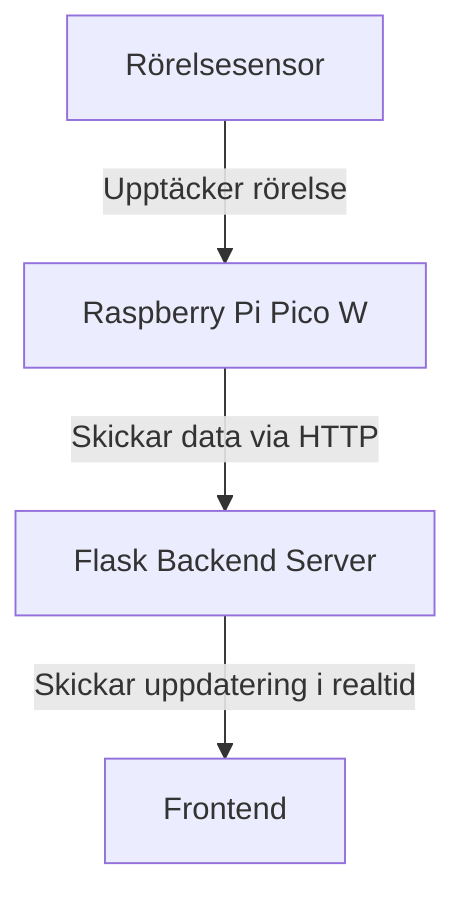

```mermaid
graph TD;
    PIR["Rörelsesensor"] -->|"Upptäcker rörelse"| Pico["Raspberry Pi Pico W"];
    Pico -->|"Skickar data via HTTP"| Flask["Flask Backend Server"];
    Flask -->|"Skickar uppdatering i realtid"| Frontend["Frontend"];
```
